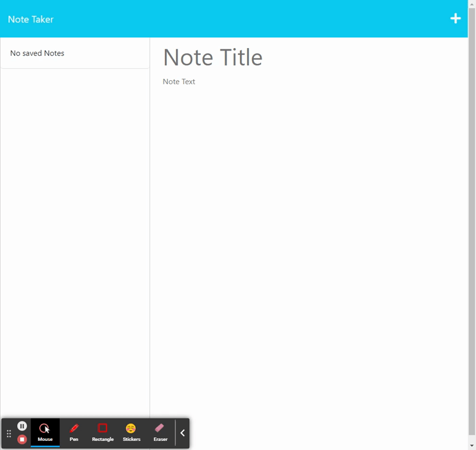

# Express.js Note Taker challenge

## Features 🌟

The Note Taker App is a web-based application built using Express.js that allows users to easily write, save, and manage notes. Whether you're a small business owner looking to organize your thoughts or someone who needs to keep track of tasks, this app has got you covered. With a simple and intuitive user interface, you can create and manage your notes hassle-free.

- Create new notes with titles and text.
- Save notes to keep them organized.
- View a list of existing notes.
- Delete notes when they're no longer needed.

## Screenshot 📸

  

  

## Demo GIF 🚀

  

## Deployment 🚀

Follow these steps to deploy the application:

1. Clone the repository: `git@github.com:Charltonortega/Note-Taker-Challenge.git`
2. Navigate to the project directory: `cd notetaker11`
3. Install dependencies: `npm install`
4. Configure environment variables, if needed.
5. Deploy to your preferred platform (Heroku).

### Links

- [Live Demo](https://fierce-oasis-48322-3eba358fcf44.herokuapp.com/)
- [Github](https://github.com/Charltonortega/Note-Taker-Challenge)

## Setup 🛠

To set up the project locally, follow these steps:

1. Clone the repository: `git clone git@github.com:Charltonortega/Note-Taker-Challenge.git`
2. Navigate to the project directory: `cd notetaker11`
3. Install dependencies: `npm install`
4. Start the application: `npm start`
5. Open your browser and go to `http://localhost:3000`.

## Usage 💻

1. Access the application through your browser or the provided URL.
2. Navigate through the interface and interact with the features.
3. Create, edit, and delete notes as per your needs.

## Resources 📚

- [Express](https://expressjs.com/) - Fast, unopinionated, minimalist web framework for Node.js.
- [uuid](https://www.npmjs.com/package/uuid) - Generate RFC-compliant UUIDs using Node.js.
- [Bootstrap](https://getbootstrap.com/) - The world’s most popular front-end open-source toolkit.
- [clog](https://www.npmjs.com/package/clog) - A simple logging library for Node.js.

## Contributing 🤝
Pull request are welcome, For major changes please open issue first to dicuss what you would like to change.
